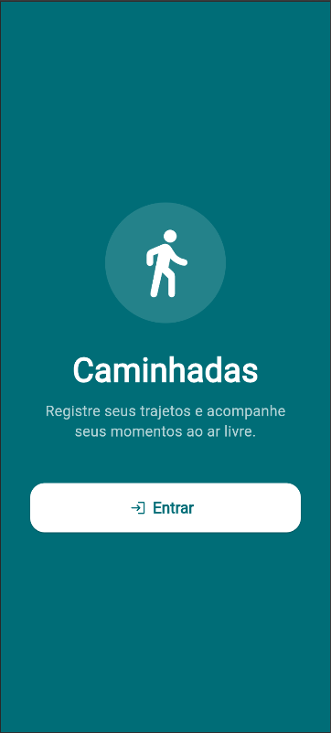
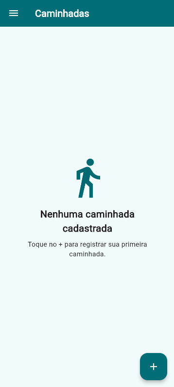
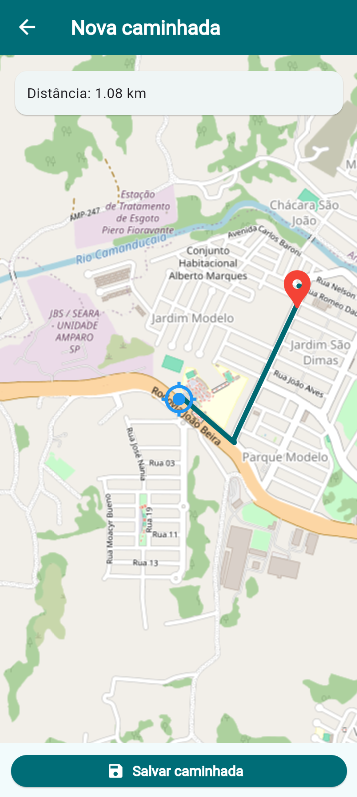
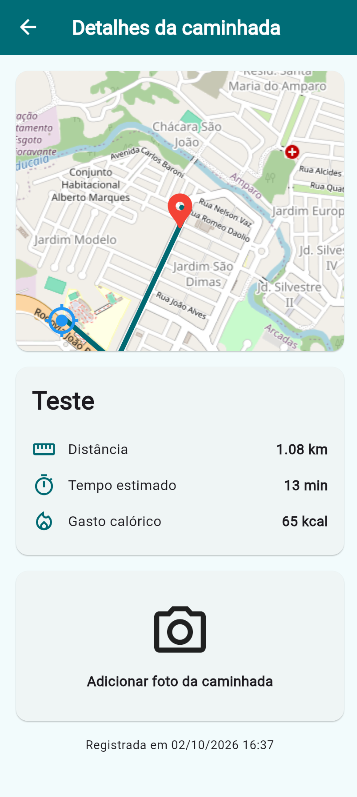

# Caminhadas

App desenvolvido em Flutter para registrar e acompanhar caminhadas.

* Splash com animação
* Menu lateral
* Tema claro e escuro
* Cadastro de caminhadas
* GPS
* Mapa
* Trajeto
* Cálculo de distância
* Estimativa de tempo e calorias
* Câmera para foto da caminhada

## Tecnologias

* Flutter
* Dart
* Flutter Map
* Geolocator
* OSRM

## Como testar

1. Clone o Repositório

2. Entre na pasta do projeto

3. Instale as dependências

```bash
flutter pub get
```

4. Execute o aplicativo

```bash
flutter run
```

Para testar o GPS e a câmera, utilize um dispositivo Android ou um emulador Android.


## Screenshots

|  |  |
| ------------------------------- | ------------------------------- |
|  |  |

## APK

[**Baixar APK**](./assets/caminhadas.apk)

